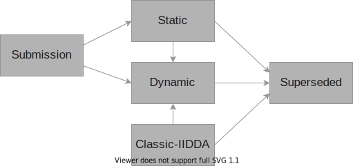

# Dataset Lifecycle States

Inspiration from https://lifecycle.r-lib.org/articles/stages.html.

## State Transitions

## State Descriptions

### Submission

Someone has submitted a new dataset that needs to be reviewed by the IIDDA core team (i.e. by someone with push-privileges). When someone from outside of the core team, `Submission`s will be created via a pull request (TODO: should _everyone_ have to submit a pull request to create a `Submission`?).

### Static

Static datasets have matured in that they have been determined to comply with all IIDDA standards, and will only be changed if errors are detected.

### Dynamic

Dynamic datasets are mature and have a stable structure, but will change regularly as new data get added to the sources.

### Classic-IIDDA

This is an initial state for a dataset with source that is uploaded directly as an csv/xlsx file that used to be on the classic IIDDA website https://davidearn.mcmaster.ca/iidda.

Any file that begins in the `Classic-IIDDA` state can programmatically be pulled together.

### Superseded

The data in a Superseded dataset has been added to another dataset because it has been determined that this is a more natural home for the data.

## Dataset Versioning

`major.minor`

* `major` version changes indicate a lifecycle transition
* `minor` version changes indicate that the source data have changed

Commit hashes are used for finer-grained changes, so there is no need for a `patch` number.

TODO: Where does the dataset version live? Either a small top-level file or buried in the metadata?

## Dataset State History

All datasets should contain a file `lifecycle-states` that lists the state transitions and the times that they happened.

TODO: Define the format of these files and a process for automatically generating them. GitHub actions sort of make sense, but not until the process is mature and I'm a little concerned that GitHub actions itself is likely to introduce breaking changes in the medium future.